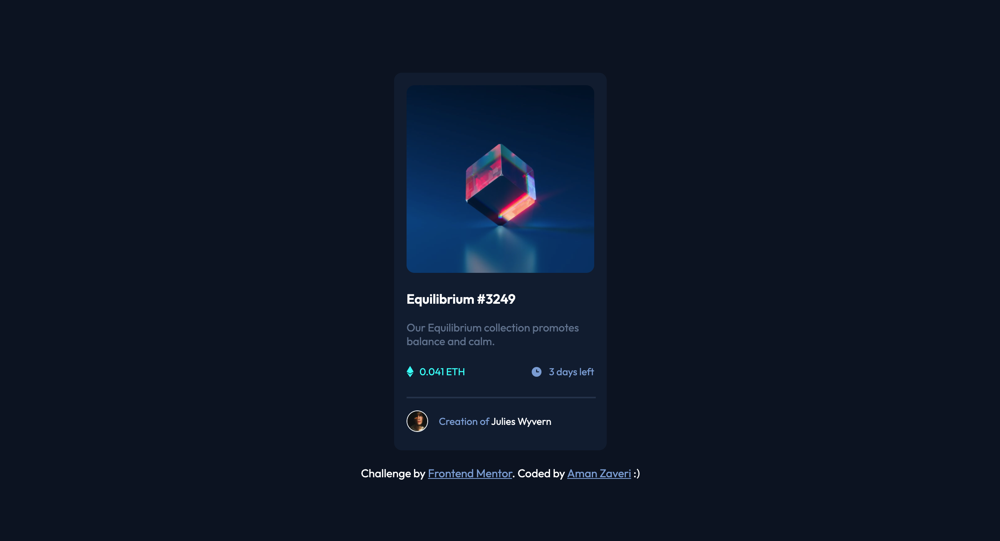

# Frontend Mentor - NFT preview card component solution

This is a solution to the [NFT preview card component challenge on Frontend Mentor](https://www.frontendmentor.io/challenges/nft-preview-card-component-SbdUL_w0U). Frontend Mentor challenges help you improve your coding skills by building realistic projects. 

## Table of contents

- [Overview](#overview)
  - [The challenge](#the-challenge)
  - [Screenshot](#screenshot)
  - [Links](#links)
- [My process](#my-process)
  - [Built with](#built-with)
  - [What I learned](#what-i-learned)
  - [Continued development](#continued-development)
- [Author](#author)

## Overview

This project includes a card with an image of Equilibrium with a description on it. On top of that, the author is listed at the bottom.

### The challenge

Users should be able to:

- View the optimal layout depending on their device's screen size

### Screenshot



### Links

- Solution URL: [Add solution URL here](https://your-solution-url.com)
- Live Site URL: [Add live site URL here](https://your-live-site-url.com)

## My process

1. Added all necessary components needed
2. Centered all of the components
3. Changed the font and colour as needed


### Built with

- Semantic HTML5 markup
- CSS custom properties
- Flexbox
- CSS Grid

### What I learned

In this project, I was able to learn how to add a border to a circular image:

```css
.author {
  border-radius: 100%;
  border: 1px solid white;
  height: 1.6em;
}
```

### Continued development

I want to continue working with the displays, but also expanding my knowledge on the different types of properties they hold.

## Author

- LinkedIn - [Aman Zaveri](https://www.linkedin.com/in/aman-zaveri-23a5501b6/)
- Frontend Mentor - [@Aman-Zaveri](https://www.frontendmentor.io/profile/Aman-Zaveri)
